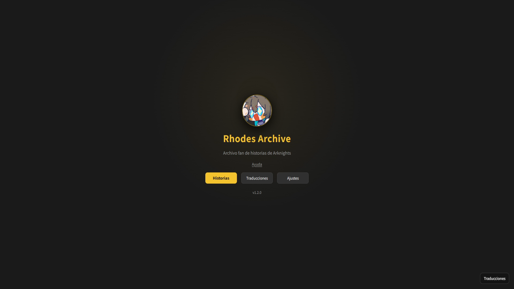
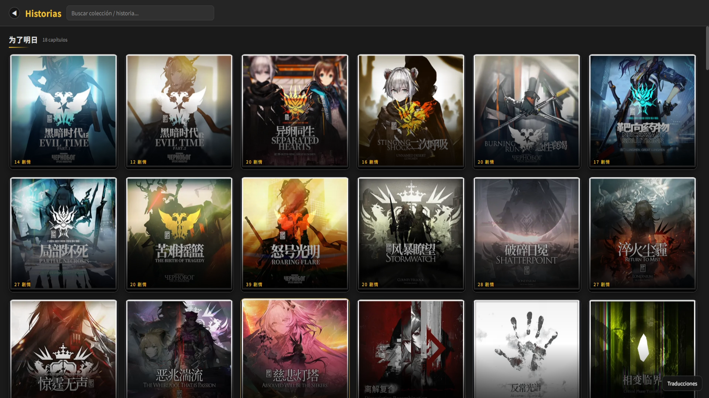
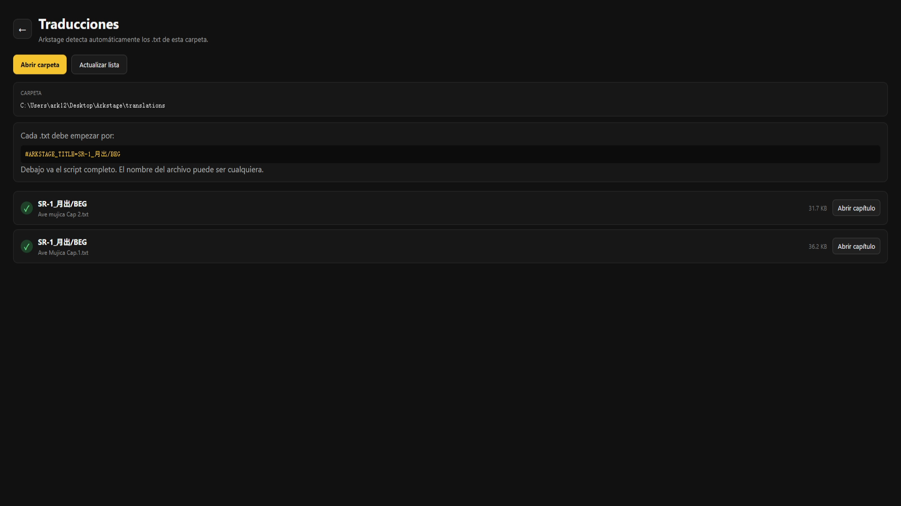

<div align="center">


# Rhodes Archive

### Archivo fan de historias de Arknights

Reproduce, archiva y disfruta historias de **Arknights** con soporte para traducciones personalizadas.

[](LICENSE)


### ⬇️ Descargar

[](https://github.com/LOKNNE/Rhodes-Archive/releases/download/v1.2.0-alpha/Rhodes-Archive-v1.2.0-alpha-Windows-x64-Setup.exe)

[Ver todas las versiones](https://github.com/LOKNNE/Rhodes-Archive/releases)

[YouTube](https://www.youtube.com/@LOKNNE) · [Reddit](https://www.reddit.com/user/LOKNNE/)

</div>

---

## 📸 Capturas

### Pantalla principal

<div align="center">
  
</div>

### Biblioteca de historias

<div align="center">
  
</div>

### Traducciones

<div align="center">
  
</div>

---

## ✨ Qué es Rhodes Archive

**Rhodes Archive** es un proyecto fan no oficial basado en el proyecto open-source **Arkstage**. Su objetivo es facilitar la reproducción, archivo y traducción de historias de Arknights, empezando por una experiencia adaptada al español.

El proyecto sigue en desarrollo y puede cambiar con frecuencia.

## ⭐ Funciones actuales

- 🇪🇸 Interfaz principal en español
- 📖 Reproducción de historias con StoryPlayer
- 🌐 Carga de traducciones externas en archivos `.txt`
- 🎬 Reproductor a pantalla completa
- ⏩ Modo automático mediante la tecla `A` cuando está disponible
- 💾 Caché local de recursos
- 📦 Gestión y compresión de recursos
- 🗂️ Sección propia de **Traducciones**
- 🎨 Interfaz y branding personalizados de Rhodes Archive

## 🌍 Sistema de traducciones

Las traducciones se guardan como archivos `.txt` independientes. Cada archivo debe empezar con una línea como esta:

```txt
#ARKSTAGE_TITLE=PAGE_TITLE
```

Debajo se incluye el script completo traducido de la historia.

Ejemplo de carpeta:

```text
translations/
├── Ave Mujica Cap.1.txt
└── Ave Mujica Cap 2.txt
```

Si Rhodes Archive encuentra una traducción cuyo `PAGE_TITLE` coincide con la historia seleccionada, la carga automáticamente. Si no existe, utiliza el texto original.

## 🛠️ Desarrollo

El proyecto utiliza principalmente:

- **Tauri 2**
- **Rust**
- **React**
- **TypeScript**
- **StoryPlayer / recursos de PRTS Wiki**

Para ejecutar el proyecto en desarrollo:

```bash
npm install
npm run tauri dev
```

> Este repositorio está en desarrollo activo. Algunas funciones pueden estar incompletas o cambiar entre versiones.

## 📺 Comunidad

Puedes seguir el proyecto y las traducciones aquí:

- **YouTube:** https://www.youtube.com/@LOKNNE
- **Reddit:** https://www.reddit.com/user/LOKNNE/

## ❤️ Créditos

Rhodes Archive está basado en **Arkstage** y utiliza tecnología y recursos relacionados con **PRTS Wiki / StoryPlayer**.

Gracias a los desarrolladores y comunidades que han hecho posibles estas herramientas.

## ⚠️ Aviso legal

Rhodes Archive es un proyecto fan **no oficial** y no está afiliado con Hypergryph, Gryphline ni PRTS Wiki.

**Arknights**, sus personajes, historias, ilustraciones, música, audio y demás recursos pertenecen a **Hypergryph** y a sus respectivos propietarios.

El repositorio no pretende reclamar propiedad sobre ningún recurso original de Arknights.

## 📄 Licencia

El código propio y las modificaciones originales de este repositorio se publican bajo la **MIT License**.

La licencia MIT **no se aplica** a textos, imágenes, audio, música ni otros recursos protegidos pertenecientes a Hypergryph u otros titulares de derechos.

---

<div align="center">

**Rhodes Archive** · made by [LOKNNE](https://github.com/LOKNNE)

</div>
